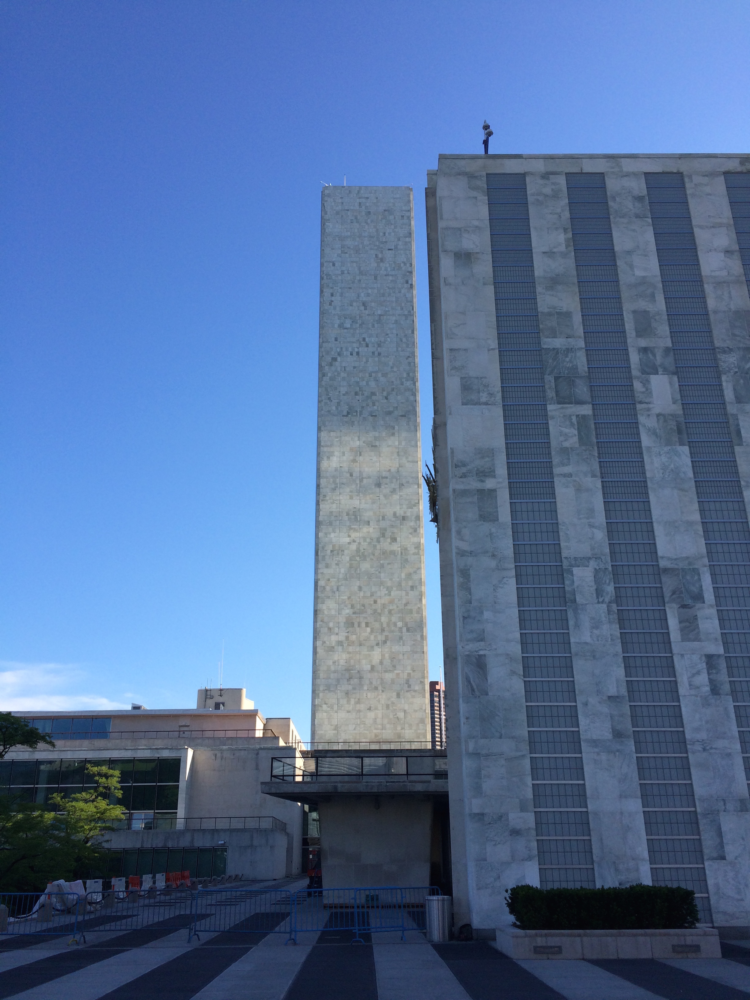

#Thoughts from State of the Map US (#SOTMUS) 

This past weekend ~850 people attended the [State of the Map US](http://stateofthemap.us/) (SOTMUS) conference at the United Nations in New York City, NY. The conference is centered around a global mapping dataset called [OpenStreetMap](http://www.openstreetmap.org/) (OSM). 

> OpenStreetMap is a map of the world, created by people like you and free to use under an open license.

Learn more about [OpenStreetMap](http://www.openstreetmap.org/about).

<iframe width="100%" height="200" frameborder="0" scrolling="no" marginheight="0" marginwidth="0" src="http://www.openstreetmap.org/export/embed.html?bbox=-77.32177734375%2C37.57070524233116%2C-70.59814453125%2C43.77902662160831&amp;layer=mapnik&amp;marker=40.74725696280421%2C-73.95996093749999" style="border: 1px solid black"></iframe> <small><a href="http://www.openstreetmap.org/?mlat=40.747&amp;mlon=-73.960#map=7/40.747/-73.960">View Larger Map</a></small>

*The United Nations Building*

I went to SOTMUS 2014 in Washington, D.C. and thought the sessions and community were great. So I was looking forward to attending the event again in 2015. The cost was pretty cheap as far as conferences were concerned and I live in New York City so I ended up bypassing expensing the event through work and paid the $90 early bird registration fee.

* Cost - I paid $90 for the early bird registration and live in NY. 
* [Scholarship Options](http://stateofthemap.us/scholarships/)

*SOTMUS 2015 group photo*

*SOTMUS 2015 program and stickers*

*SOTMUS 2015 t-shirt*

*UN rose garden*

[Megan Smith ](http://seen.co/event/state-of-the-map-us--2015-5454/highlight/485499)

* Selfie from space

* The Humanitarian
Data Exchange data links:
	
	* [The Humanitarian
Data Exchange](https://data.hdx.rwlabs.org/)

	* [Global Assessment Report on Disaster Risk Reduction 2015](http://risk.preventionweb.net/capraviewer/main.jsp?countrycode=g15)

	* [Ebola GeoNode](http://ebolageonode.org/)

* Randy Meech's talk

	* title?
	* converstation about those profiting off using OSM. 
	
##Takeaways

####[Code of Conduct](http://stateofthemap.us/codeofconduct/)

One thing that I've noticed with the OSM community and State of the Map in general is a concept of openness and understanding. The [Code of Conduct](http://stateofthemap.us/codeofconduct/) embraces and emphasizes those concepts. It's very healthy to talk about and bring up the Code of Conduct as I think it helps and reminds attendees that we are all at the event to celebrate a truly great community and the work they put into OpenStreetMap. Being negative or disrespectful is antithetical to the purpose of OSM. That said, healthy and vibrant debate is encouraged amongst the community. Ideas can be challenged but people should respect one another. 

I think there is very healthy debate about companies and individuals who use OpenStreetMap data to help build and create their business. And I think Randy Meech's talk **[O.S.M.B.A. The history and future of companies in OpenStreetMap](http://stateofthemap.us/osmba-the-history-and-future-of-companies-in-openstreetmap/)** touched on some of that great debate. However, as a community I think we may find that **bashing** companies and software doesn't help. If the community has problem with a software company maybe the energy spent bashing that company or software would be better placed to developing better open source alternatives. 

####Geocoding 
Geocoding is the next big component to work on in the FOSS4G/Open Data stack. While I missed the **[State of the Geocoder](______)** (side note: Saturday is such a busy day that some folks, including me, find it tough to get to the venue early on Sunday) talk I was able to catch [@IanDee](https://twitter.com/iandees)'s **[OpenAddresses](_________)** talk. 

Why can't we develop open geocoding methods for desktop and possibly even the web? With points, the task requires some text-matching and some parsing problems, but for the most part has been conceptually completed by **Esri**. Esri's geocoding systems are properietary but it wouldn't be difficult to develop the open source community's ideas on address matching with Esri's system serving as a template. 

####Stickers
Everyone loves stickers at conferences. I may retire from geo and start a sticker company. 

####Social Events
I think its difficult to plan events to that everyone enjoys. Even amongst close friends, details and even the routes and transportation modes can stir up debate. I think the events were a success overall and the challenges of engaging folks that were at a conference all day and are tired combined with the pressure of getting them out to view and enjoy a city they may be unfamiliar with is very difficult. I truly commend the conference organizers for doing such a great job. My only suggestion for next year is that the events could be scaled back. My opinion is that the location is secondary to the community. Maybe less focus on getting folks out and about and more on just bringing good food and drinks to a modest location is enough to please all OpenStreetMappers. 

####OSM-derived Art
http://mapisart.com/ - very cool. 

####Do we have an ethical obligation to contribute to OSM? Prior to disaster? 

####Thoughts/Comments
I don't have a comments section on this site but if you have any comments feel free to start a conversation on Twitter with me [@NYGeog](https://twitter.com/nygeog). Also, if anything on this post violates the [Code of Conduct](http://stateofthemap.us/codeofconduct/) for State of the Map let me know and I'll gladly modify it. 