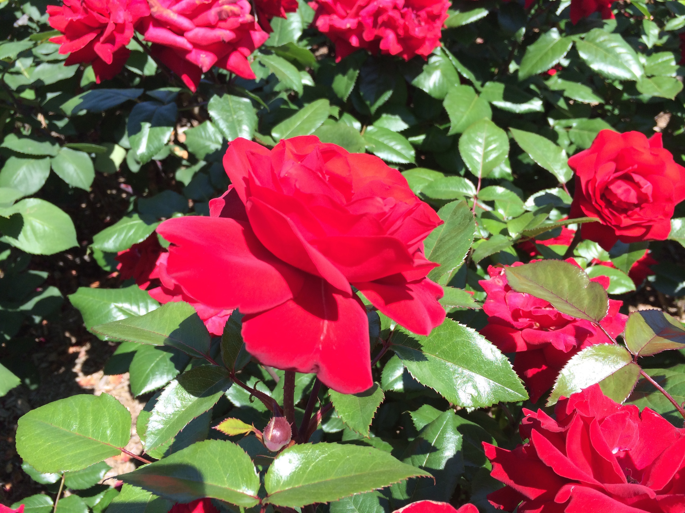

*UN rose garden*

[Megan Smith ](http://seen.co/event/state-of-the-map-us--2015-5454/highlight/485499)

* Selfie from space

* The Humanitarian
Data Exchange data links:
	
	* [The Humanitarian
Data Exchange](https://data.hdx.rwlabs.org/)

	* [Global Assessment Report on Disaster Risk Reduction 2015](http://risk.preventionweb.net/capraviewer/main.jsp?countrycode=g15)

	* [Ebola GeoNode](http://ebolageonode.org/)

* Randy Meech's talk

	* title?
	* converstation about those profiting off using OSM. 
	

####Social Events
I think its difficult to plan events to that everyone enjoys. Even amongst close friends, details and even the routes and transportation modes can stir up debate. I think the events were a success overall and the challenges of engaging folks that were at a conference all day and are tired combined with the pressure of getting them out to view and enjoy a city they may be unfamiliar with is very difficult. I truly commend the conference organizers for doing such a great job. My only suggestion for next year is that the events could be scaled back. My opinion is that the location is secondary to the community. Maybe less focus on getting folks out and about and more on just bringing good food and drinks to a modest location is enough to please all OpenStreetMappers. 

####OSM-derived Art
http://mapisart.com/ - very cool. 

####Do we have an ethical obligation to contribute to OSM? Prior to disaster? 

####Thoughts/Comments
I don't have a comments section on this site but if you have any comments feel free to start a conversation on Twitter with me [@NYGeog](https://twitter.com/nygeog). Also, if anything on this post violates the [Code of Conduct](http://stateofthemap.us/codeofconduct/) for State of the Map let me know and I'll gladly modify it. 